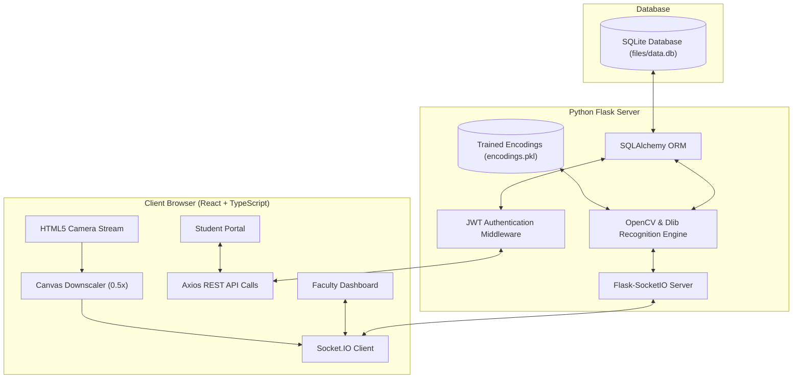

# 🎓 ClassAssistant AI
> **An Intelligent Camera-Based Automated Attendance System**

[](https://reactjs.org/)
[](https://vitejs.dev/)
[](https://flask.palletsprojects.com/)
[](https://opencv.org/)
[](https://www.sqlite.org/)

---

## 🌟 System Overview

**ClassAssistant AI** is an enterprise-grade academic platform designed to automate student attendance verification using deep-learning facial recognition. Replacing slow and proxy-vulnerable manual roll calls, ClassAssistant AI streams live webcam feeds over WebSockets, extracts 128-dimensional biometric facial encodings in real time, and persists attendance with **strict course code and date-wise isolation**.

The platform provides dedicated role-based portals for **Administrators**, **Faculty Members**, and **Students**, featuring excuse notice approval workflows, exportable attendance matrix reports (PDF & Excel), and an automated conflict-free **Exam Routine Scheduler**.

---

## ✨ Key Features

### 👩‍🏫 Faculty Portal
- **Live Webcam Attendance Capture**: One-click camera streaming powered by `Socket.IO` for real-time multi-student face detection.
- **Date-Wise & Course-Wise Scoping**: Select any past or active class date; attendance is bound strictly to the selected course (`course_code`) and date.
- **Absence Reason Approval Workflow**: View student excuse notices with explicit **Accept** and **Reject** controls that dynamically update student attendance statuses.
- **Global Reason Inbox**: Searchable inbox listing all student excuse messages across courses.
- **One-Click Export**: Export comprehensive Attendance Matrix summaries directly to **PDF** (landscape layout) or **Excel (.xlsx)**.

### 👨‍🎓 Student Portal
- **Course Attendance Overview**: Real-time progress indicators showing *Total Classes Held*, *Attended Classes*, *Absent Classes*, and *Attendance Percentage*.
- **Academic Standing Status Badges**:
  - 🟢 **Good Standing**: $\ge 80\%$
  - 🟡 **Warning**: $70\% - 79\%$
  - 🔴 **Low Attendance**: $< 70\%$
- **Absence Notice Submission**: Submit excuse reasons with attached course codes and dates directly to course instructors.
- **Recent Attendance History**: Detailed table view of check-in times, check-out times, total minutes stayed, and course titles.

### 🔑 Admin Portal & AI Training Pipeline
- **Course & User Management**: Assign students and faculty members to specific course sections.
- **Biometric Dataset Generator**: Interactive camera wizard capturing 30 face samples per student with automated facial alignment.
- **Automated Encodings Training**: One-click training script generating 128-d Dlib deep face embeddings serialized to `files/encodings.pkl`.
- **Smart Exam Routine Generator**: Automated scheduler that computes conflict-free exam timetables avoiding student overlap.

---

## 🛠️ Technology Stack

| Domain | Technologies Used |
| :--- | :--- |
| **Frontend UI/UX** | React 18, TypeScript, Vite, TailwindCSS, Lucide React Icons |
| **Data Visualization & Export** | Canvas API, `jsPDF`, `xlsx` |
| **Backend Framework** | Python 3.10+, Flask, Flask-CORS, Flask-SocketIO |
| **Computer Vision & AI** | OpenCV (`cv2`), `face_recognition` (Dlib DNN 128-d Encodings), NumPy |
| **Authentication & Security** | PyJWT (HTTP-only Cookies), Werkzeug Password Hashing (`bcrypt`) |
| **Database & ORM** | SQLite (`files/data.db`), SQLAlchemy ORM |

---

## 🏗️ System Architecture



---

## 🚀 Getting Started

### Prerequisites
- **Python**: Version 3.10 or higher
- **Node.js**: Version 18.x or higher
- **C++ Compiler**: CMake and Visual Studio C++ Build Tools (required for `dlib` compilation on Windows)

---

### 1️⃣ Backend Setup

```bash
# Navigate to the backend directory
cd backend

# Create a virtual environment
python -m venv venv

# Activate virtual environment
# Windows (PowerShell):
.\venv\Scripts\Activate.ps1
# Linux/macOS:
source venv/bin/activate

# Install required dependencies
pip install -r requirements.txt

# Start the Flask backend server
python web_app.py
```
> The backend server will start at `http://localhost:5000`

---

### 2️⃣ Frontend Setup

```bash
# Open a new terminal and navigate to the front-end directory
cd front-end

# Install npm dependencies
npm install

# Start the Vite development server
npm run dev
```
> The frontend application will run at `http://localhost:5173`

---

## 👤 Credentials (Demo)

| Role | Email | Password | Access Rights |
| :--- | :--- | :--- | :--- |
| **Admin** | `admin@green.edu.bd` | `admin123` | User management, AI Dataset training, Exam Routine generator |
| **Faculty** | `teacher@green.edu.bd` | `teacher123` | Live webcam attendance, absence approval, matrix exports |
| **Student** | `student@green.edu.bd` | `student123` | Course metrics, absence reason submission, attendance history |

---

## 📜 Project Structure

```
ClassAssistant/
├── backend/
│   ├── files/
│   │   ├── dataset/             # Student facial image datasets
│   │   ├── detectors/           # SSD / Caffe / Haar detector models
│   │   ├── data.db              # SQLite relational database
│   │   └── encodings.pkl        # Trained 128-d face encodings
│   ├── src/
│   │   ├── db.py                # SQLAlchemy engine & session setup
│   │   ├── models.py            # Database tables (Student, Teacher, Course, Attendance)
│   │   ├── settings.py          # Environment settings
│   │   └── libs/
│   │       ├── train_classifier.py  # Face encodings extraction script
│   │       ├── web_utils.py     # Utility functions
│   │       └── image_helper.py  # OpenCV image preprocessing
│   └── web_app.py               # Main Flask API & Socket.IO server
│
├── front-end/
│   ├── src/
│   │   ├── components/
│   │   │   ├── admin/           # Admin Dashboard & Routine Generator
│   │   │   ├── faculty/         # Faculty Dashboard & Webcam Viewport
│   │   │   ├── student/         # Student Portal & Metrics View
│   │   │   └── auth/            # Login & Registration Components
│   │   ├── index.css            # Tailwind & CSS Tokens
│   │   └── App.tsx              # Router & Role Authorization
│   ├── package.json
│   └── vite.config.ts
└── README.md
```

---

## 📄 License

Distributed under the **MIT License**. See `LICENSE` for details.